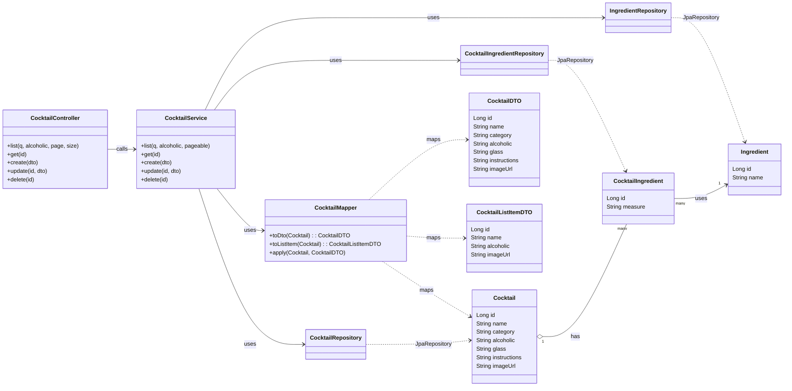

# 🍹 Cocktail Backend – Spring Boot (LB 295)

## 📌 Projektbeschreibung
Dieses Projekt ist ein **Spring Boot Backend** für eine Cocktail-Webanwendung, welche in [LB_Projekt_m294](https://github.com/raktonon/LB_Projekt_m294) zu finden ist.  
Es stellt eine **interne CRUD-API** bereit, sodass das M294-Frontend ohne Änderungen weiterverwendet werden kann.

Das Backend nutzt **PostgreSQL** (Docker-Container) als Hauptdatenbank und **H2** als In-Memory-Datenbank für Tests.  

---
## 🔄 Änderungen im Frontend
Das M294-Frontend wurde ursprünglich für die öffentliche TheCocktailDB API entwickelt.
Damit es mit dem M295-Backend funktioniert, müssen folgende Anpassungen vorgenommen werden:

#### 1. API-URLs umstellen
Statt ``` https://www.thecocktaildb.com/... ``` auf ```http://localhost:8080/api/cocktails``` verweisen.

#### 2. Feldnamen anpassen
- ```strDrink → name```   
- ```strInstructions → instructions```   
- ```strDrinkThumb → imageUrl```   

#### 3. Such- und Detailendpunkte ändern
- Suche: ```?q={suchbegriff}```   
- Details: ```/api/cocktails/{id}```   

#### 4. Bilder sicherstellen
- Entweder ```imageUrl```-Feld im Backend pflegen oder Frontend auf lokale Bilder umstellen.


Diese Änderungen sind optional und nur nötig, falls das M294-Frontend direkt mit diesem Backend betrieben werden soll.

---

## 📂 Projektstruktur
```
src/main/java/com/wiss/cocktailbackend
│
├── config/            # SwaggerConfig, WebConfig
├── controller/        # CocktailController
├── dto/               # CocktailDTO, CocktailListItemDTO
├── entity/            # JPA-Entitys (Cocktail, CocktailIngredient, Ingredient)
├── mapper/            # CocktailMapper
├── repository/        # Repositorys (CocktailIngredientRepository, CocktailRepository, IngredientRepository)
├── service/           # CocktailService
└── CocktailBackendApplication.java
```

### Klassendiagramm



---

## 🐳 Docker-Setup für PostgreSQL

Das Projekt nutzt PostgreSQL in einem Docker-Container.  
Die Konfiguration ist in der Datei **`docker-compose-cocktails.yml`** enthalten.

### 1️⃣ Docker-Container starten
```bash
docker compose -f docker-compose-cocktails.yml up -d
```
- Erstellt einen Container mit dem Namen `cocktail_postgres`
- Nutzt die Zugangsdaten aus `application.properties`
- Standard-Port: **5433** (5432 wird schon vom Frontend belegt)

### 2️⃣ Umgebungsvariablen (aus `docker-compose-cocktails.yml`)
```yaml
environment:
  POSTGRES_DB: cocktail_app
  POSTGRES_USER: cocktail_user
  POSTGRES_PASSWORD: cocktail_password
```

### 3️⃣ Container stoppen
```bash
docker compose -f docker-compose-cocktails.yml down
```

### 4️⃣ Initialdaten
Beim ersten Start wird das SQL-Skript **`data.sql`** ausgeführt und befüllt die Datenbank mit Beispieldaten.  
💡 **Hinweis:**  
Falls die Initialdaten erneut geladen werden sollen, muss man das zugehörige Docker-Volume löschen:
```bash
docker volume rm <volume-name>
```
(Ersetze `<volume-name>` durch den Namen aus `docker volume ls`, z. B. `cocktail_postgres_data`)

---

## 🗂 API-Endpunkte

### 🔹 **Interne CRUD-API** (`/api/cocktails`)
| Methode | Pfad                      | Beschreibung                      |
|---------|---------------------------|------------------------------------|
| GET     | `/api/cocktails`           | Liste aller Cocktails (Paged)     |
| GET     | `/api/cocktails/{id}`      | Einzelcocktail abrufen            |
| POST    | `/api/cocktails`           | Neuen Cocktail anlegen            |
| PUT     | `/api/cocktails/{id}`      | Cocktail aktualisieren            |
| DELETE  | `/api/cocktails/{id}`      | Cocktail löschen                   |

---

## 🧪 Tests
Das Projekt enthält **6 Unit- und Integrationstests**:
- `CocktailRepositoryTest` (Suchlogik)
- `CocktailServiceTest` (Fehlerfälle)
- `CocktailMapperTest` (Core-Mapping)
- `CocktailControllerCrudTest` (CRUD-Controller)
- `CocktailPersistenceTest` (JPA Persistenz)
- `CocktailBackendApplicationTests` (Fehlerfreies starten der Applikation)

Tests ausführen:
```bash
mvn test
```

---

## 🛠 Technologie-Stack
- **Java 21**
- **Spring Boot 3.5.x**
- **Spring Web**
- **Spring Data JPA**
- **PostgreSQL**
- **H2 Database (Tests)**
- **Jakarta Validation**
- **Swagger / Springdoc OpenAPI**
- **Maven**

---

## 💡 Hilfestellungen

- [Tutorialspoint](https://www.tutorialspoint.com/spring_boot/index.htm) wurde als Nachschlagewerk für verschiedene Java- und Spring-Boot-Konzepte genutzt.  
  Die Erklärungen dort inklusive Codebeispielen waren sehr hilfreich.

- ChatGPT wurde genutzt als:  
  - Strukturierungshilfe beim modularen Aufbau des Projekts  
  - Unterstützung bei der Fehlersuche allgemein, z. B. bei Fehlermeldungen im Zusammenhang mit Spring Boot, JPA und Maven  
  - Hilfe bei der Gestaltung der API-Struktur und Testklassen
  - Hinweise zu Best Practices im Umgang mit Docker, PostgreSQL und H2 für Tests  

- Google Classroom (Kurse 295_BE 2-7) wurde als Nachschlagewerk für die Vorgaben und den Aufbau des Projekts genutzt.

- Ein [Markdown Cheatsheet](https://github.com/adam-p/markdown-here/wiki/markdown-cheatsheet) von Github wurde für diese Dokumentation als Nachschlagewerk benutzt.

